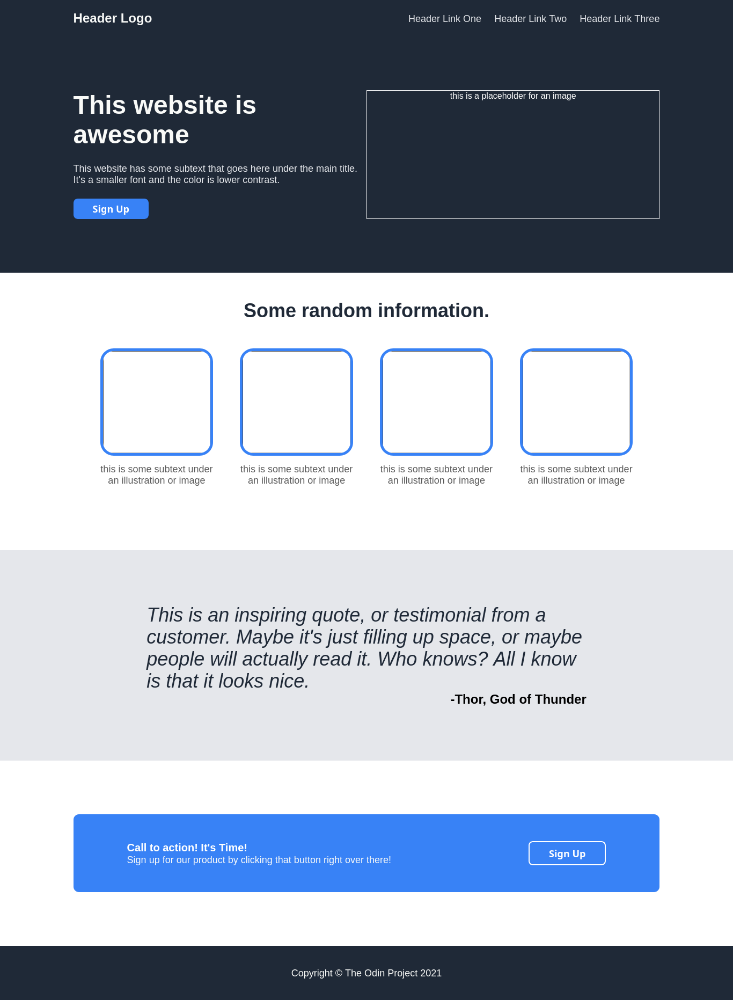

# Landing Page

This is a landing page that I created as part of the [The Odin Project](https://www.theodinproject.com) curriculum's [Landing Page Project](https://www.theodinproject.com/lessons/foundations-landing-page) lesson in [Foundations Course](https://www.theodinproject.com/paths/foundations/courses/foundations).

Here's a link to the live preview of the project:

[Live Preview](https://rautra.github.io/landing-page/)

And here's a screenshot of how it looks on my computer:

